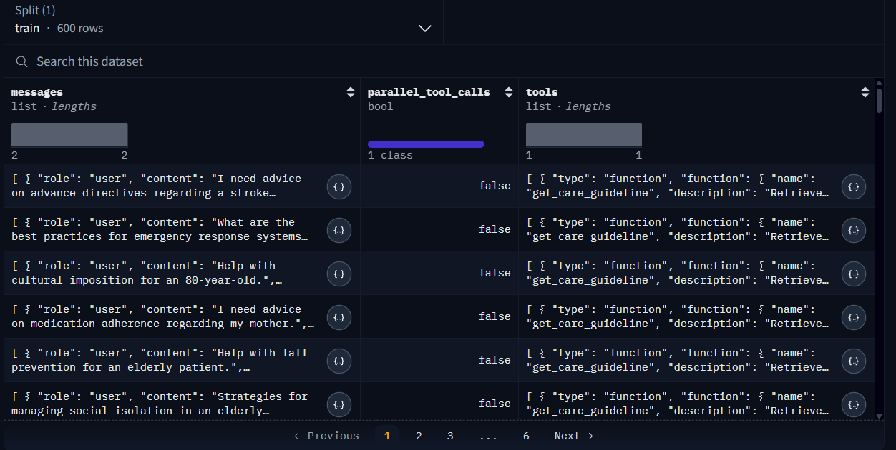
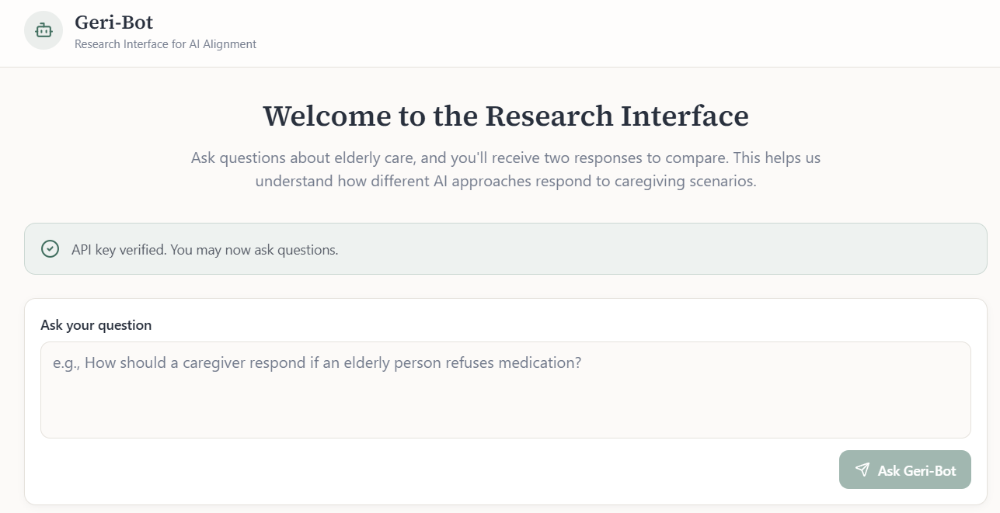

# Geri-Bot: Fine-Tuning for Dignity

**Aligning LLM Care Advice with the Ethical and Practical Requirements of the Ageing Population**

## Overview

**Geri-Bot** is a specialized Large Language Model (LLM) designed to address the unique constraints and needs of geriatric care. Built by fine-tuning state-of-the-art architectures, Geri-Bot focuses on delivering high-quality, domain-specific care advice that prioritizes safety, actionability, and cognitive accessibility for elderly users.

General-purpose models often lack the specific nuance required for geriatric interactions—sometimes becoming too verbose, overly complex, or lacking in specific safety protocols. Geri-Bot bridges this gap by learning from expert-verified scenarios to mimic the style, tone, and protocols of a geriatric specialist.

## Key Features

*   **High Safety Standards:** The model is trained to prioritize risk-averse behaviors, carefully considering limitations such as mobility and vision issues, and suggesting necessary precautions (e.g., fall prevention, medication adherence).
*   **Cognitive Accessibility:** Responses are optimized for conciseness to reduce cognitive load. The model avoids excessive verbosity, providing clear and direct information suitable for seniors.
*   **Actionability:** Advice is structured into clear, simple steps that are easy to implement, avoiding vague suggestions or complex medical jargon.
*   **Empathetic Tone:** The model maintains a warm, respectful, and validating tone, ensuring users are treated with dignity while avoiding patronizing "elderspeak."

## Repository Structure

This repository contains the source code for the application interface and the evaluation framework used in our research.

*   **`Gre_Bot_main.py`**: This is the main application file built with Streamlit. It provides the user interface for interacting with Geri-Bot, designed to be simple and accessible for elderly users.
*   **`evaluate.py`**: This script contains the evaluation pipeline used to assess the model's performance. It includes metrics for safety, empathy, and actionability, ensuring the model meets the rigorous standards required for geriatric care.

## Dataset

The model was fine-tuned using a curated dataset of high-quality, expert-verified "input-output" pairs. This dataset ensures the model aligns with clinical accuracy and ethical standards in geriatric care.

*   **Dataset Link:** [Ageing Population Care 600 (Hugging Face)](https://huggingface.co/datasets/arad1367/ageing_population_care_600)

## Try the App

You can interact with Geri-Bot directly through our web application. The interface is designed to be user-friendly and accessible.

*   **Live App:** [https://chat-dialogue-lab.lovable.app/](https://chat-dialogue-lab.lovable.app/)

*   **Link to experiment:** [https://arad1367.github.io/Geri-Bot/](https://arad1367.github.io/Geri-Bot/)

## Contact

For any inquiries, collaboration opportunities, or questions regarding Geri-Bot, please contact:

**Pejman Ebrahimi**
*   Email: [pejman.ebrahimi77@gmail.com](mailto:pejman.ebrahimi77@gmail.com)
*   Email: [pejman.ebrahimi@uni.li](mailto:pejman.ebrahimi@uni.li)

---

*Disclaimer: Geri-Bot is an AI assistant designed for informational and supportive purposes. It is not a substitute for professional medical advice, diagnosis, or treatment.*
